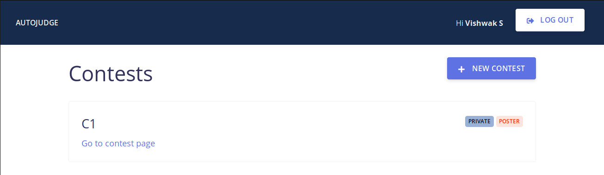
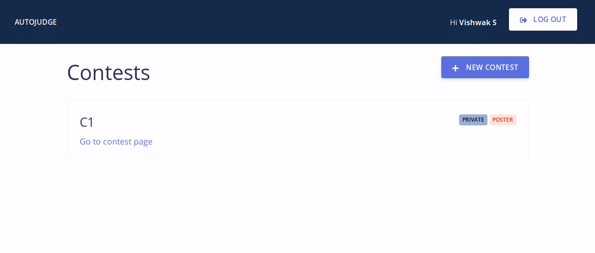
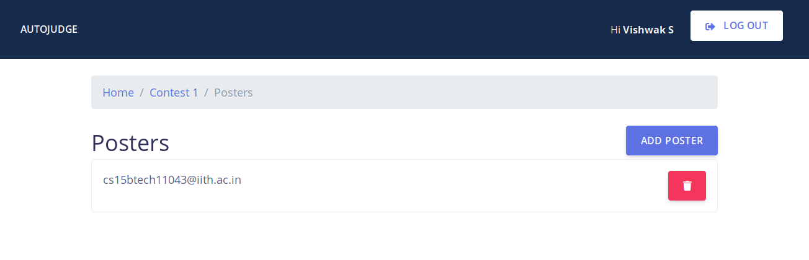

User Manual for ``autojudge``
=============================

Some important abstractions / terminology used in ``autojudge``
---------------------------------------------------------------

.. note::
    Please make note of the terms in **bold**

The judge works on graph between **contests** and **users**. A **contest** consists of a set of **problems**. A **user** is, well, a **user** - with different roles.

A user can be either a **poster**, **participant** or neither. A **user** is associated with the **contest** with one and only one role - either a **poster**, **participant** or neither.

The user who creates a new **contest** becomes the **poster** for the **contest** by default.
This user can add more **posters** to help coordinate the **contest** (perhaps by setting new **problems**, verifying and commenting on **submissions**, and so on).

While creating a new **contest**, the first **poster** has an option to either allow select **participants**, or to leave it open for all.
The former kind of a **contest** is a **private contest**, and the latter kind of a **contest** is a **public contest** (for obvious reasons). No **poster** is allowed to take part in a **contest** as a **participant** i.e., he/she cannot submit solutions.

If the **contest** is **public**, every user is either a **poster** or a **participant**. If the **contest** is **private**, a user can either be a **poster**, a **participant** or neither - in which case, he/she will not be permitted to participant in the **contest**.

Maybe a short example will help you understand if something is confusing....

Example:
~~~~~~~~

Take the case of a course assignment with programming questions. These programming questions could compose a **contest**, where each question is a **problem**. The instructor and the TAs can be thought of as the **posters**, while registered students for the course would be **participants**. Students not registered for the course will not be able to participate in this **contest** - as you would expect.

Hands-on with ``autojudge``
---------------------------

Creating your account / Logging in
~~~~~~~~~~~~~~~~~~~~~~~~~~~~~~~~~~

You need to be logged in to use ``autojudge``. On the home page, click ``LOG IN`` (see the top right corner in the image below)

.. figure:: ../_images/log-in.png
   :width: 400
   :align: center
   :alt: Log in

If this is being used at an institution, please make sure you log in with your institutional account. Currently, we support Google OAuth logins.

Creating a contest
~~~~~~~~~~~~~~~~~~

Once you are logged in, follow the steps below to create a new contest.

1. Click the ``New Contest`` button on the dashboard (see beneath the blue header in the image below)

   .. figure:: ../_images/new-contest-dashboard.png
      :width: 400
      :align: center
      :alt: New contest dashboard

2. Fill out the form for creating a new contest.

   .. figure:: ../_images/contest-form.gif
      :width: 400
      :align: center
      :alt: Contest form

   .. note::
        The contest name distinguishes contests, hence every contest must have a unique name. Failure to provide a unique name will throw an interactive error.

   .. note::
       *Penalty* is a value between 0 and 1 and specifies the per day penalty on submissions made after *soft end date*. For example: a contest having 0.1 penalty for example, would give 90% of the actually scored points by a submission if it is made within 24 hours after *soft end date* but before *hard end date*.

   .. note::
       It is advised that *linter scoring* be disabled unless all code submissions are made in Python.

   .. note::
       Enable *poster scoring* if you would like the posters to give points in addition to those given by the judge.

You should be able to see the newly created contest on your dashboard. No one else would be able to see this new contest on their dashboard until the start time of this contest.

Click on the contest in the link on the dashboard to edit it.

To add more posters to the contest, click on ``SEE POSTERS``.
You can add one or more posters by adding their emails in a comma separated list after clicking on ``ADD POSTER``.
The new poster(s) would now be able to see this contest on their dashboard (even before the start time). They can also edit the contest.
To delete posters, click on the red bin button adjacent to each poster's email ID.

In the case of a private contest, the poster(s) can also see a ``SEE PARTICIPANTS`` button.
Clicking this will lead them to a page where they can edit the ``Participant`` list in the same manner as the poster list.

.. note::
    Trying to add a user both as a participant and a poster will not be permitted.

Any of the posters can update the dates of the contest by clicking on ``UPDATE DATES``.
Please update the dates before they pass, and attempting to do so will throw an interactive error.

Note that a participant cannot add or delete other participants or posters. Also he/she cannot update the dates.

A poster can also delete a contest using the button at the bottom of the contest page.

Managing problems in a contest
~~~~~~~~~~~~~~~~~~~~~~~~~~~~~~

A contest consists of problems. Problems can be added, edited or deleted by the posters of the contest.

A problem can be added to a contest only before the start time of the contest.
To add a problem to the contest, follow the steps below:

1. Click ``ADD PROBLEM`` from the contest's homepage.

   .. figure:: ../_images/new-problem-contest.png
      :width: 400
      :align: center
      :alt: New problem contest

2. Fill the form that follows. Short descriptions for fields in the form are provided.

   .. figure:: ../_images/problem-form.gif
      :width: 400
      :align: center
      :alt: Problem form

   .. note::
       The problem code distinctly identifies a problem, hence every problem must have a unique name. Failure to provide a unique name will throw an interactive error.

   .. note::
       In case the compilation script and test script are left empty, the default ones are used. The default scripts can be downloaded from the links just below the Browse button for each of them.

3. After submission, you can add or delete **test cases** on the problem page. There are two kinds of test cases - **public test cases** and **private test cases**. **Public test cases** would be visible to the participants while **private test cases** won't be visible.

   .. figure:: ../_images/problem-test-case.gif
      :width: 400
      :align: center
      :alt: Problem test case

   .. note::
       Test case addition and deletion will be allowed only till the start of the contest.

Posters can edit or delete an existing problem in the contest using the 2 icons on the top-right of the problem page (see to the right of the problem title).

   .. figure:: ../_images/problem-edit-delete.png
      :width: 400
      :align: center
      :alt: Problem edit delete

   .. note::
       Deletion of a problem is only allowed until the contest begins.

Submitting and checking submissions: Participant end
~~~~~~~~~~~~~~~~~~~~~~~~~~~~~~~~~~~~~~~~~~~~~~~~~~~~

A participant can make **submission** for a problem from the problem page. Select the language and upload the submission file.

To check your previous **submissions**, and the judge's score for your **submissions**, click ``SEE MY PREVIOUS SUBMISSIONS`` at the bottom of the problem page.

If you want a detailed verdict of the judge for a **submission**, click on that **submission**. You can see the verdict of the judge on individual **test cases** concisely below or in detail by clicking on a **test case**. You can also download your **submission** from here as well.

Once the contest begins and participants start submitting, the **leaderboard** is initialized and can be seen on the contest page.
The leaderboard lists the participants in the decreasing order of sum of scores in individual problems in the contest.

Please note that the *max score* seen on the problem page is the maximum score possible per test case. For example, if there are 5 test cases and *max score* is 10 points, then a participant can score at most 50 points for that problem by the judge (i.e., notwithstanding the linter score and/or the poster score).

Managing submissions from the poster's side
~~~~~~~~~~~~~~~~~~~~~~~~~~~~~~~~~~~~~~~~~~~

Posters can see all the **submissions** pertaining to a problem in the problem page by clicking ``SEE ALL SUBMISSIONS`` at the bottom of the page.

**Submissions** made by all the participants for a given problem would be available here. Click on any **submission** to open the **submission** page. The layout is the same as that seen by the participants.

In case *poster scoring* is enabled for the contest, the poster can give a score from the **submission** page by clicking on ``UPDATE POSTER SCORE`` on the top right adjacent to the download icon. Poster score can be any integer.

The poster can also view the submission file from the **submission** page by downloading it via the ``DOWNLOAD`` button on the top right.

Commenting
~~~~~~~~~~

Posters and participants can also comment. A **comment** by a participant to a problem can be viewed by all posters but not by any other participants - similar to private comments on Google Classroom.

To see old **comments** or create a new one, click on ``SEE ALL SUBMISSIONS`` on the problem page.

Miscellaneous
~~~~~~~~~~~~~

A poster can download a CSV file containing the best scores of all participants in a contest by clicking on ``DOWNLOAD SCORES`` from the contest page.
