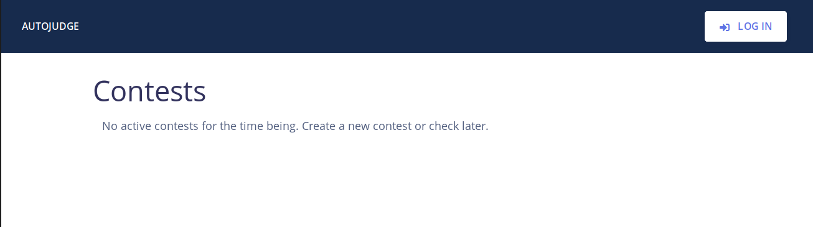

User Manual for ``autojudge``
=============================

Some important abstractions / terminology used in ``autojudge``
---------------------------------------------------------------

.. note::
    Please make note of the terms in **bold**

The judge works on graph between **contests** and **users**. A **contest** consists of a set of **problems**. A **user** is, well, a **user** - with different roles.

A user can be either a **poster**, **participant** or neither. A **user** is associated with the **contest** with one and only one role - either a **poster**, **participant** or neither.

The user who creates a new **contest** becomes the **poster** for the **contest** by default.
This user can add more **posters** to help coordinate the **contest** (perhaps by setting new **problems**, verifying and commenting on **submissions**, and so on).

While creating a new **contest**, the first **poster** has an option to either allow select **participants**, or to leave it open for all.
The former kind of a **contest** is a **private contest**, and the latter kind of a **contest** is a **public contest** (for obvious reasons). No **poster** is allowed to take part in a **contest** as a **participant** i.e., he/she cannot submit solutions.

If the **contest** is **public**, every user is either a **poster** or a **participant**. If the **contest** is **private**, a user can either be a **poster**, a **participant** or neither - in which case, he/she will not be permitted to participant in the **contest**.

Maybe a short example will help you understand if something is confusing....

Example:
~~~~~~~~

Take the case of a course assignment with programming questions. These programming questions could compose a **contest**, where each question is a **problem**. The instructor and the TAs can be thought of as the **posters**, while registered students for the course would be **participants**. Students not registered for the course will not be able to participate in this **contest** - as you would expect.

Hands-on with ``autojudge``
---------------------------

Creating your account / Logging in
~~~~~~~~~~~~~~~~~~~~~~~~~~~~~~~~~~

You need to be logged in to use ``autojudge``. On the home page, click ``LOG IN`` (see top right corner in the image below)

If this is being used at an institution, please make sure you log in with your institutional account. Currently, we support Google OAuth logins.

Creating a **contest**
----------------------

Once you are logged in, follow the steps below to create a new **contest**.

1. Click the ``New Contest`` button on the dashboard.
2. Fill out the form for creating the New Contest. 

    - Contest Name distingushes contests and so every contest must have a unique and new name.
    - The ``Soft End Date`` of the ``Contest`` is the date after which all the submissions would incur penalty.
    - The ``Hard End Date`` is the 'deadline' of the assignment; the judge stops accepting submissions after this time.
    - ``Penalty`` is a value between 0 and 1 and specifies the per day penalty on submissions made after Soft End Date.
    - A ``Contest`` having 0.1 penalty for example, would give 90% of the actaully scored points by a submission if it is made within 24 hours of ``Soft End Date`` but before the ``Hard End Date``.
    - It is advised that linter scoring be disabled unless all code submissions are made in Python.
    - Enable ``poster scoring`` if you would like the TA's to give points on top of the ones given by judge.

3. You should be able to see the newly created ``Contest`` on your dashboard. No one else would be able to see this new ``Contest`` on their dashboard until the start time of the ``Contest``.
4. Click on the ``Contest`` in the link on the dashboard to edit it.
5. To add a ``Poster`` to the ``Contest`` click on ``SEE POSTERS``. You can add and delete ``Poster`` s from here. You can add multiple ``Poster`` s by adding their emails in a comma seperated list. The new ``Poster`` s would now be able to see this ``Contest`` on their dashboard (even before the start time). They can also edit the ``Contest``.
6. In case of ``Private Contest`` the ``Poster`` s can also see a ``SEE PARTICIPANTS`` button through which they can edit the ``Participant`` list. Note that trying to add a User both as a ``Participant`` and a ``Poster`` will not be permitted. Avoid editing the ``Poster`` and ``Participant`` list after the ``Contest`` starts.
7. The ``Poster`` can update the dates of the contest from ``UPDATE DATES``. Please update the dates before they actually happen. Updating the ``Soft End date`` and/or ``Hard End Date`` after they have passed would not be allowed.
8. Note that a ``Participant`` cannot add or delete ``Participant`` or ``Poster``. Also (s)he cannot update the dates.

In addition to these a ``Poster`` can delete a ``Contest`` from the button at the bottom of the contest page.

Managing ``Problem``
--------------------

A ``Contest`` consists of ``Problem`` s. Only a ``Poster`` can add / edit / delete ``Problem`` s.

1. ``Problem`` can be added only before the start time of the ``Contest``. To add a ``Problem`` click add ``ADD PROBLEM`` from the ``Contest`` page, and fill the form.

    - A unique problem code distinctly identifies a ``Problem``.
    - In case the Compilation Script and Test Script are left empty, the default ones are used.
    - Fill the other feilds appropriately.

2. In the next page, called the ``Problem`` page, add and manage the test-cases. Public test-cases would be visible to the ``Participant`` s while Private ones won't be. Note that test-case addition / deletion will be allowed only till the start of the ``Contest``.
3. A ``Poster`` can edit / delete a ``Problem`` using the 2 buttons on the top-right of the ``Problem`` page. Deletion of a ``Problem`` is only allowed until the ``Contest`` begins.

Managing ``Submission`` for the ``Participant``
-------------------------------------------

TODO

Managing ``Submission`` for the ``Poster``
--------------------------------------

TODO

Commenting
----------

TODO
