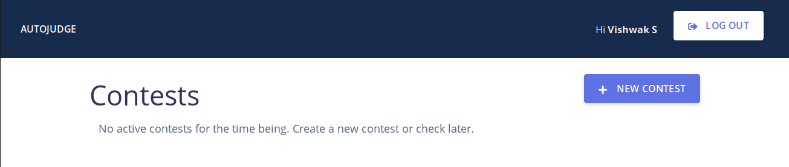

User Manual for ``autojudge``
=============================

Some important abstractions / terminology used in ``autojudge``
---------------------------------------------------------------

.. note::
    Please make note of the terms in **bold**

The judge works on graph between **contests** and **users**. A **contest** consists of a set of **problems**. A **user** is, well, a **user** - with different roles.

A user can be either a **poster**, **participant** or neither. A **user** is associated with the **contest** with one and only one role - either a **poster**, **participant** or neither.

The user who creates a new **contest** becomes the **poster** for the **contest** by default.
This user can add more **posters** to help coordinate the **contest** (perhaps by setting new **problems**, verifying and commenting on **submissions**, and so on).

While creating a new **contest**, the first **poster** has an option to either allow select **participants**, or to leave it open for all.
The former kind of a **contest** is a **private contest**, and the latter kind of a **contest** is a **public contest** (for obvious reasons). No **poster** is allowed to take part in a **contest** as a **participant** i.e., he/she cannot submit solutions.

If the **contest** is **public**, every user is either a **poster** or a **participant**. If the **contest** is **private**, a user can either be a **poster**, a **participant** or neither - in which case, he/she will not be permitted to participant in the **contest**.

Maybe a short example will help you understand if something is confusing....

Example:
~~~~~~~~

Take the case of a course assignment with programming questions. These programming questions could compose a **contest**, where each question is a **problem**. The instructor and the TAs can be thought of as the **posters**, while registered students for the course would be **participants**. Students not registered for the course will not be able to participate in this **contest** - as you would expect.

Hands-on with ``autojudge``
---------------------------

Creating your account / Logging in
~~~~~~~~~~~~~~~~~~~~~~~~~~~~~~~~~~

You need to be logged in to use ``autojudge``. On the home page, click ``LOG IN`` (see the top right corner in the image below)

.. image:: ../_images/log-in.png
   :width: 400
   :align: center
   :alt: Log in

If this is being used at an institution, please make sure you log in with your institutional account. Currently, we support Google OAuth logins.

Creating a contest
------------------

Once you are logged in, follow the steps below to create a new contest.

1. Click the ``New Contest`` button on the dashboard (see beneath the blue header in the image below)

2. Fill out the form for creating a new contest.

   .. image:: ../_images/contest-form.gif
      :width: 400
      :align: center
      :alt: Contest form

   .. note::
        The contest name distinguishes contests, hence every contest must have a unique name. Failure to provide a unique name will throw an interactive error.

   .. note::
       *Penalty* is a value between 0 and 1 and specifies the per day penalty on submissions made after *soft end date*. For example: a contest having 0.1 penalty for example, would give 90% of the actually scored points by a submission if it is made within 24 hours after *soft end date* but before *hard end date*.

   .. note::
       It is advised that *linter scoring* be disabled unless all code submissions are made in Python.

   .. note::
       Enable *poster scoring* if you would like the posters to give points in addition to those given by the judge.

You should be able to see the newly created contest on your dashboard. No one else would be able to see this new contest on their dashboard until the start time of this contest.

Click on the contest in the link on the dashboard to edit it.

.. image:: ../_images/contest-detail-click.gif
   :width: 400
   :align: center
   :alt: Contest detail click

To add more posters to the contest, click on ``SEE POSTERS``.
You can add one or more posters by adding their emails in a comma separated list after clicking on ``ADD POSTER``.
The new poster(s) would now be able to see this contest on their dashboard (even before the start time). They can also edit the contest.
To delete posters, click on the red bin button adjacent to each poster's email ID.

In the case of a private contest, the poster(s) can also see a ``SEE PARTICIPANTS`` button.
Clicking this will lead them to a page where they can edit the ``Participant`` list in the same manner as the poster list.

.. note::
    Trying to add a user both as a participant and a poster will not be permitted.

Any of the posters can update the dates of the contest by clicking on ``UPDATE DATES``.
Please update the dates before they pass, and attempting to do so will throw an interactive error.

Note that a participant cannot add or delete other participants or posters. Also he/she cannot update the dates.

A poster can also delete a contest using the button at the bottom of the contest page.

Managing ``Problem``
--------------------

A ``Contest`` consists of ``Problem`` s. Only a ``Poster`` can add / edit / delete ``Problem`` s.

1. ``Problem`` can be added only before the start time of the ``Contest``. To add a ``Problem`` click add ``ADD PROBLEM`` from the ``Contest`` page, and fill the form.

    - A unique problem code distinctly identifies a ``Problem``.
    - In case the Compilation Script and Test Script are left empty, the default ones are used.
    - Fill the other feilds appropriately.

2. In the next page, called the ``Problem`` page, add and manage the test-cases. Public test-cases would be visible to the ``Participant`` s while Private ones won't be. Note that test-case addition / deletion will be allowed only till the start of the ``Contest``.
3. A ``Poster`` can edit / delete a ``Problem`` using the 2 buttons on the top-right of the ``Problem`` page. Deletion of a ``Problem`` is only allowed until the ``Contest`` begins.

Managing ``Submission`` for the ``Participant``
-----------------------------------------------

TODO

Managing ``Submission`` for the ``Poster``
------------------------------------------

TODO

Commenting
----------

TODO
